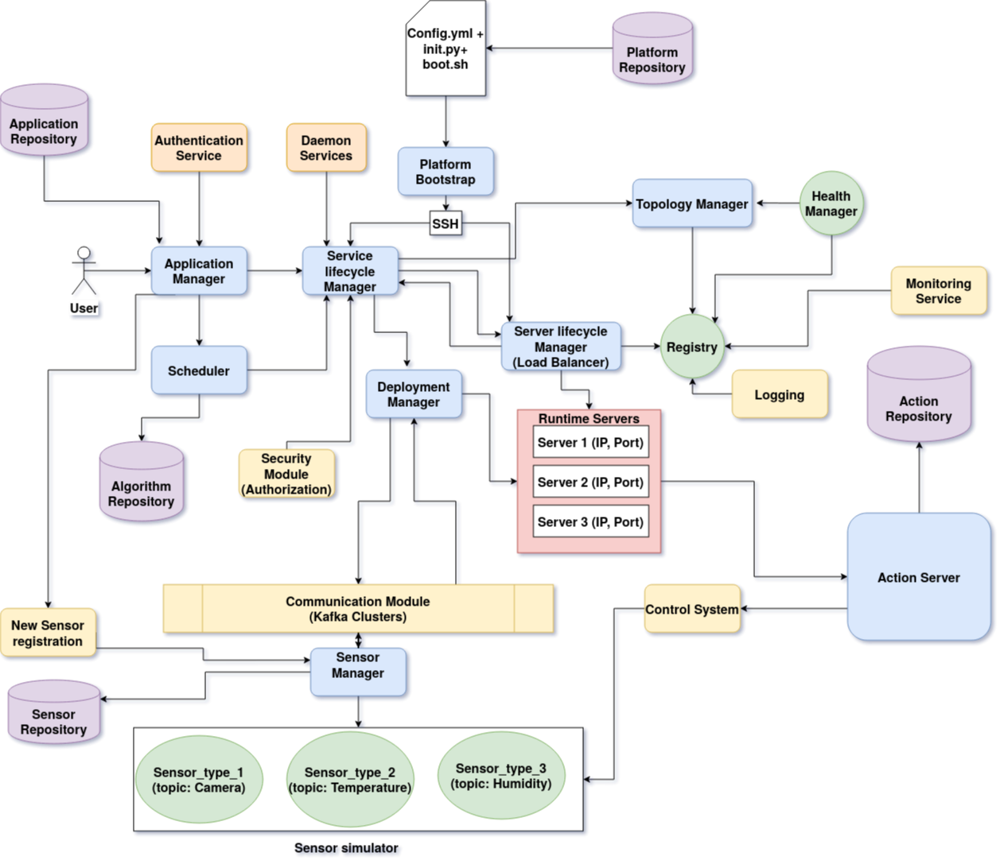

# Welcome to the Distributed IOT Platform for Smart Cities
-----------------------------------------------------------------------------------------------------------------------------
Distributed platform that provides build, development and deployment functionalities. The platform will be able to deploy and run applications that can be used to manage a smart city.

   Features of the platform:
   -------------------------
    1. Simple
    2. Resilient
    3. Fault Tolerant
    4. Maintainable

# Architecture:

-----------------------------------------------------------------------------------------------------------------------------
### To boot up the platform :

   First go to the platform directory, then run the following command:
   
     $ sudo python3 Bootstrap/init.py
     
----------------------------------------------------------------------------------------------------------------------------

#### IP and Port for Application Deployment 
https://localhost:5555/sign-up

----------------------------------------------------------------------------------------------------------------------------
#### IP and Port to see the User dashboard
https://localhost:3333

----------------------------------------------------------------------------------------------------------------------------
#### Important commands

1. docker run --rm --network=host new
2. sudo docker kill $(sudo docker ps -q)

----------------------------------------------------------------------------------------------------------------------------
#### Communication Module
1. Download and setup docker , docker compose
2. Now goto the bootstrap module and run init.py (it is doing docker-compose up for kafka)
3. Goto the communation_module directory and import communication module
4. Call the Sample producer interface
     communication_module.ApplicationManager_to_ServiceLifeCycle_Producer_interface(mess) [ see ApplicationManger.py ]
5. Call the Sample consumer interface
     communication_module.ApplicationManager_to_ServiceLifeCycle_interface(fun) [see ServiceLifeCycle.py ]
6. Communication module video link : https://www.youtube.com/watch?v=rixFLCBNLao&t=333s

----------------------------------------------------------------------------------------------------------------------------

